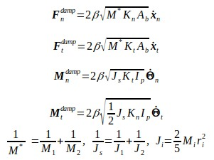
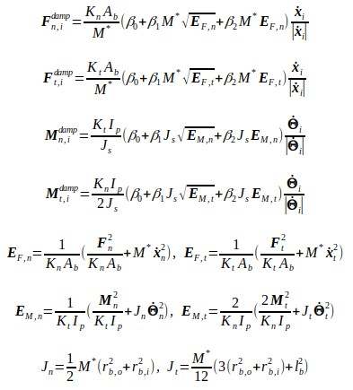
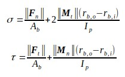

# LIGGGHTS Flexible Fibers

[Home](Home)

[Commands](commands)

## Bond Style Gran Command

### Syntax

```text
bond_type gran
bond_coeff 1 ro ri Ybond Gbond damp_type damp_val(s) break_type break_val(s)
```

### Examples

```text
bond_style gran
bond_coeff 1 1.0 0.0 1.5e9 1.0e9 1 1.0 0 0.01
bond_coeff 1 1.0 0.0 1.5e9 1.0e9 1 1.0 1 1.5e6 1.0e6
bond_coeff 1 1.0 0.0 1.5e9 1.0e9 1 1.0 2 1.5e6 1.0e6 330.0
bond_coeff 1 1.0 0.0 1.5e9 1.0e9 2 0.0 0.01 0.0 1 1.5e6 1.0e6
bond_coeff 1 1.0 0.0 1.5e9 1.0e9 2 0.0 0.01 0.0 5 1.5e6 1.0e6
```

---

### Warning

This is a beta version... Be Carefull...

---

### Description

The *gran* bond style uses the following force and moment equation


The granular bond is adopted from D.O. Potyondy and P.A. Cundall's original
paper, "A Bonded-Particle for Rock". The model currently utilizes two
different damping styles, one inspired by Guo et al. (2013) and slightly
modified by Schramm et al. (2019) (linear damp [1]).



and a nonlinear damping version (nonlinear damp [2]) and is currently being
tested and submitted for peer review.



The bond *gran* model offers five break styles. The simple break style
(Break_Style 1) looks at the distance between two spheres and if the distance
is greater than 2*r_break, the bond is considered to be broken. The next
method (Break_Style 2) checks the maximum stress inside the bond. If the
stress is greater than a critcal stress, the bond breaks. The user needs to
supply the critical normal stress (Pa) and the critical tangential stress
(Pa). The maximum stress is calculated as follows.



The thrid break style (Break_Style 3) expands on the stress dependent method
by looking at the average temperature between the two bonded spheres. If this
average temperature is greater than a critical temperature, the bond breaks.
The user must also add the following fixes to use this break style.

```text
fix ftco all property/global thermalConductivity peratomtype 5.
fix ftca all property/global thermalCapacity peratomtype 10.
fix heattransfer all heat/gran initial_temperature 300.
```

Break styles 4 and 5 are *soft* break methods in which the bond does not break
until the two atoms have seperated completly allowing for heavily overlapped
atoms that were bonded to break without exploding. Both styles reset the bond
length between the atoms to the distance at which the bond broke and provides
a normal force to seperate the two atoms. Break style 4 simply uses 1% of the
origianl normal stiffness while break style 5 uses the hertzian contact law .

The following coeffectients must be defined for each bond type via the
[bond_coeff](bond_coeff) command as in the examples shown above, or in the
data file or restart files read by the [read_data](read_data) or
[read_restart](read_restart) commands:

* *ro* is the percentage of the outer radius of the bond in respect to the
atom radius and takes values between 0 and 1.0
* *ri* is the percentage of the inner radius of the bond in respect to the
atom radius and takes values between 0 and 1.0 and must be less than *ro*
* *Ybond* is the bond Young's modulus in Pa
* *Gbond* is the bond shear modulus in Pa
* *damp_type* is the type of damping to be used in the simulation and takes
values of 0 (no damping), 1 (linear damping), or 2 (nonlinear damping)
* *damp_val(s)* is the bond coefficients. For damp_type 0, the user must still
set a value but it will not be used. For damp_type 1 a single damping
coefficent is used and takes values greater than 0.0. For damp_type 2 three
damping coefficeints must be provided.
* *break_type* is the type of breaking to be used in the simulation and takes
values 0 or 1 or 2 or 3 or 4 or 5.
* *break_val(s)* are the coefficients to be used with a break_type. For
break_type 1, a single value is needed. For break_type 2,4, and 5 two values
must be provided. For break_type 3 three values must be provided.

## Experimental Features

A fix for accurate normal stifness values has been added when using *smooth*
fibers. This fix can be applied by adding the additional define durring the
building process (See the [how to install](how_to_install#-Additional-Flags) section for more
info):

-DDO_SMOOTH_FIBER_FIX

## Restrictions

This bond style can only be used if LIGGGHTS(R)-PUBLIC was built with the
MOLECULAR package (which it is by default). See the
[How to Install](how_to_install#-Packages) section for more info on packages.

## Related Commands

[bond_coeff](bond_coeff)
[delete_bonds](delete_bonds)

### Defaults

none
